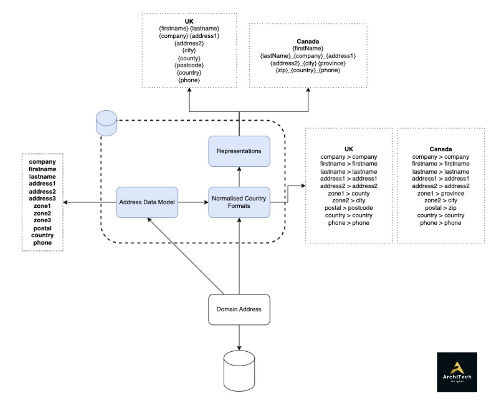
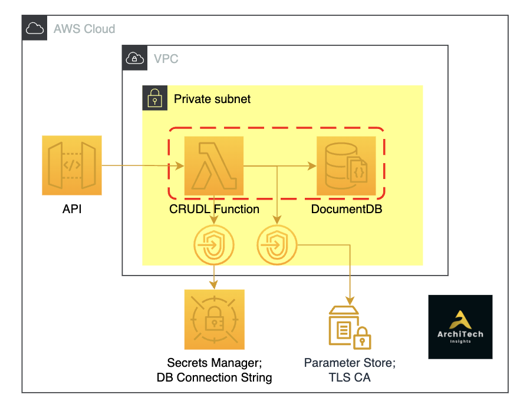
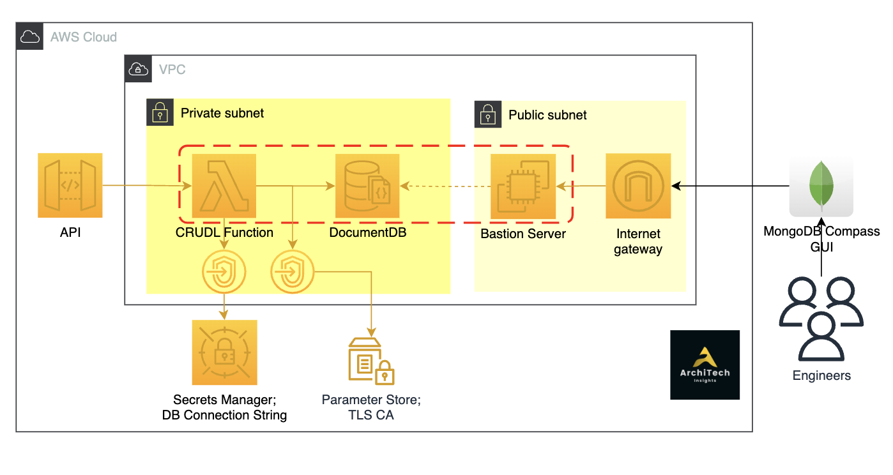
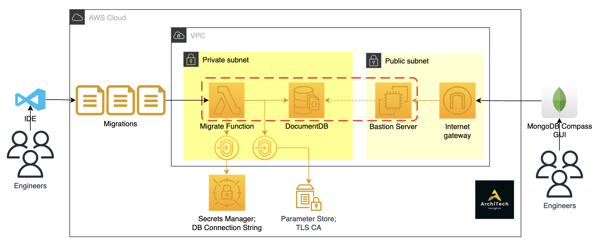

# Getting Started with AWS DocumentDB

What We'll Cover

- What is a document database and AWS' managed offering
- How can we set one up using AWS CDK (IAC)

Then once we have an database up and running:

- How can we connect and view from a GUI; MongoDB Compass
- How can we run migrations and seed data in the database
- How can we connect to it using an AWS Lambda function

## High Level

Our example database will be an international address normalisation piece that can be consumed by our in-house engineering domain teams to capture and display addresses and convert addresses from integrated products into a company address model.

## Technical Architecture

### Basic

### Connecting via MongoDB Compass GUI

### Running Migrations from Lambda

